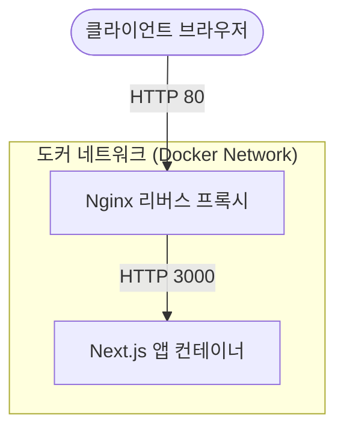

# 톡참새 (EnglishYoutube)

이 프로젝트는 [Next.js](https://nextjs.org)를 기반으로 작성된 웹 애플리케이션입니다.

## 🐳 도커 아키텍처 및 배포 구조

본 프로젝트는 손쉬운 배포와 확장을 위해 도커(Docker) 환경으로 구성되어 있습니다. Nginx 리버스 프록시가 앞단에서 트래픽을 받아 독립된 Next.js 앱 컨테이너로 전달하는 아키텍처입니다.



## 🚀 Rocky Linux 가상머신(VM) 자동 배포 가이드

Rocky Linux와 같은 완전히 새로운 가상머신 서버에서도 아래 **명령어 3줄**만 입력하면 도커 설치부터 서비스 배포까지 자동으로 완료됩니다!

**1. 깃허브 저장소 다운로드 (Clone)**
```bash
git clone https://github.com/hugingstar/EnglishYoutube.git
```

**2. 프로젝트 폴더로 이동**
```bash
cd EnglishYoutube
```

**3. 자동 배포 스크립트 실행**
```bash
./build.sh
```

> **💡 스크립트 실행 안내**
> - 실행 시 서버에 Docker가 없다면 가장 최신 버전을 자동으로 설치하고 권한을 세팅합니다.
> - Rocky Linux의 기본 방화벽(`firewalld`)이 켜져 있다면, **자동으로 80번 포트를 개방**합니다.
> - 잠시 후 터미널에 **1번(Docker Hub 이미지 다운로드)** 또는 **2번(로컬 소스코드 빌드)** 옵션을 선택하라는 메시지가 나옵니다.
> - 가상머신 환경에서는 리소스를 절약하고 가장 빠르게 띄울 수 있는 숫자 `1`을 입력하시는 것을 권장합니다.
> - 완료되면 서버의 IP 주소(포트 80)로 접속하여 웹페이지가 잘 뜨는지 확인하세요!

### 🛡️ 포트 및 보안 설정 안내
가상머신 서버에 배포된 후의 네트워크 포트 접근 권한 및 트래픽 흐름은 다음과 같이 안전하게 격리되어 있습니다.

| 목적지 포트 | 연결 대상 | 외부(호스트 PC) 접속 | 도커 내부 접속 | 설명 및 트래픽 흐름 |
| :--- | :--- | :---: | :---: | :--- |
| **80** | **Nginx** | 🟢 **가능** | 🟢 **가능** | **웹 서비스 출입구**. 호스트 PC에서 `http://<VM_IP>`로 접속 시 Nginx로 연결됩니다. |
| **3000** | **Next.js (`web`)** | 🔴 **불가** | 🟢 **가능** | **안전하게 격리됨**. 외부의 다이렉트 접속은 차단되며 도커 내부망을 통해서만 접근 가능합니다. |
| **22** | **SSH** | 🟢 **가능** | - | 서버 관리를 위한 가상머신 터미널 접속 포트입니다. |

---

## 💻 로컬(PC) 개발자 가이드

### 로컬 테스트 환경 띄우기 (Windows Host PC)
Windows 환경에서는 아래 PowerShell 스크립트를 실행하면 Docker 설치 여부 확인부터 배포까지 자동으로 진행됩니다.
```powershell
.\build.ps1
```
> 스크립트 실행 후 `1`(Docker Hub) 또는 `2`(직접 빌드)를 선택하면 컨테이너가 실행됩니다. 완료 후 브라우저에서 `http://localhost` (포트 80) 로 접속하세요.

### Docker Hub 이미지 업데이트 (배포용)
수정한 코드를 새로운 버전의 도커 이미지로 만들어 Docker Hub(`yslee4050/talkchamsae:latest`)에 업로드하려면 터미널(PowerShell)에서 아래 스크립트를 실행합니다.
```powershell
.\docker-push.ps1
```
