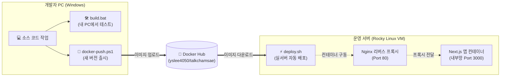

# 톡참새 (EnglishYoutube)

[Next.js](https://nextjs.org)를 기반으로 작성된 도커(Docker) 기반 웹 애플리케이션입니다. 복잡한 환경 설정 없이 스크립트 실행 한 번으로 로컬 테스트부터 운영 서버 배포까지 완벽하게 자동화되어 있습니다.

---

## 🚀 배포 워크플로우 및 아키텍처

---

## 🛠️ 스크립트 사용 가이드

본인의 역할과 운영 환경에 맞춰 아래 스크립트를 실행하세요. 모든 스크립트는 도커(Docker) 자동 설치를 지원합니다.

### 1. 개발자 전용 (Windows Host PC)
* **`build.bat`** (탐색기 더블클릭)
  * **용도:** 코드를 수정한 뒤, 내 PC에서 도커 환경이 정상 작동하는지 **테스트**할 때 사용합니다.
  * **동작:** 소스 코드를 직접 빌드하여 로컬에 서버를 띄웁니다. (`http://localhost` 접속)
* **`docker-push.ps1`** (PowerShell 실행)
  * **용도:** 작업이 끝난 새 버전을 **출시**할 때 딱 1번 사용합니다.
  * **동작:** 새로운 도커 이미지를 구워 Docker Hub에 업로드합니다.

### 2. 운영 서버 배포용 (Rocky VM / Linux)
* **`deploy.sh`** (터미널 실행)
  * **용도:** 개발자가 출시한 새 버전을 **실제 운영 서버(Rocky VM)에 반영**할 때 사용합니다.
  * **동작:** 코드를 빌드하지 않고, Docker Hub에서 이미지만 쏙 빼와 1분 안에 초고속으로 배포합니다. (방화벽 80번 포트 자동 개방 포함)
* **`build.sh`** (터미널 실행)
  * **용도:** 리눅스 환경에서 소스코드를 직접 빌드해서 띄워야 하는 특수한 상황에서만 제한적으로 사용합니다.

*(기타 윈도우용 배포 스크립트인 `build.ps1`, `deploy.ps1`도 제공되며 용도에 맞게 선택 사용 가능합니다.)*

---

## 🛡️ 포트 및 보안 설정 안내
가상머신 서버에 배포된 후의 네트워크 포트 접근 권한은 다음과 같이 안전하게 격리되어 있습니다.

| 목적지 포트 | 연결 대상 | 외부(호스트 PC) 접속 | 도커 내부 접속 | 설명 및 트래픽 흐름 |
| :--- | :--- | :---: | :---: | :--- |
| **80** | **Nginx** | 🟢 **가능** | 🟢 **가능** | **웹 서비스 출입구**. 외부에서 `http://<VM_IP>`로 접속 시 안전하게 Nginx로 연결됩니다. |
| **3000** | **Next.js (`web`)** | 🔴 **불가** | 🟢 **가능** | **안전하게 격리됨**. Nginx를 우회하는 외부의 다이렉트 접속은 차단되며 도커 내부망을 통해서만 통신합니다. |
| **22** | **SSH** | 🟢 **가능** | - | 서버 관리를 위한 가상머신 터미널 접속 포트입니다. |
