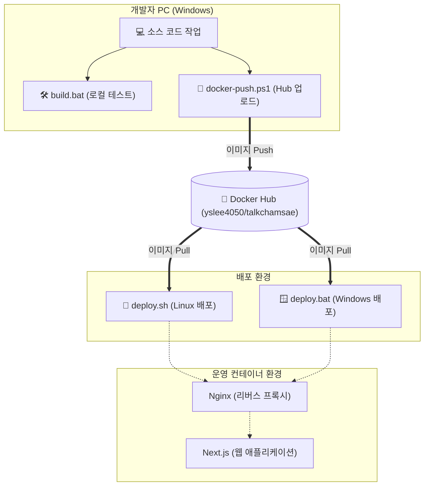

# 톡참새 (EnglishYoutube)

[Next.js](https://nextjs.org) 기반 도커(Docker) 웹 애플리케이션입니다. 스크립트 실행 한 번으로 로컬 테스트부터 운영 서버 배포까지 완벽하게 자동화되어 있습니다.

---

## 🚀 배포 워크플로우 및 아키텍처

---

## 💡 최종 요약: "도커 허브에 올려놨다!" 이후 행동 강령

도커 허브에 최신 이미지가 올라가 있는 상태라면, 오직 **배포용 스크립트(`deploy.*`) 단 하나만 실행**하시면 됩니다. 

### 💻 Windows 환경 (내 PC / 윈도우 서버 배포 시)
* **실행 명령어:** `deploy.bat` (또는 폴더에서 더블클릭)
* **동작:** 내부적으로 파워쉘 스크립트(`deploy.ps1`)를 호출하여 최신 이미지를 다운로드(Pull)받고 서버를 띄웁니다.

### 🐧 Linux 환경 (운영 서버 배포 시)
* **실행 명령어:** `./deploy.sh` (터미널 입력)
* **동작:** 최신 이미지를 즉시 다운로드(Pull)하고, 기존 옛날 컨테이너를 내린 뒤 최신 버전으로 교체합니다.

---

## 🛠️ 개발자용 스크립트 참고 가이드
코드를 수정하고 있는 "개발 단계"에서만 아래 스크립트를 사용합니다. 배포 완료 후에는 사용하지 마세요.
* **`build.bat` / `build.ps1` (Windows):** 로컬에서 코드를 직접 구워볼 때 사용
* **`build.sh` (Linux):** 리눅스 환경에서 코드를 직접 구워볼 때 사용

---

## 🛡️ 포트 및 보안 설정 안내
네트워크 포트 접근 권한은 다음과 같이 안전하게 격리되어 있습니다.

| 목적지 포트 | 연결 대상 | 외부 접속 | 도커 내부 | 설명 |
| :--- | :--- | :---: | :---: | :--- |
| **80** | **Nginx** | 🟢 **가능** | 🟢 **가능** | **웹 서비스 출입구**. Nginx로 안전하게 연결됩니다. |
| **3000** | **Next.js** | 🔴 **불가** | 🟢 **가능** | Nginx를 통해서만 접근 가능하며 외부 다이렉트 접속은 차단됩니다. |
| **22** | **SSH** | 🟢 **가능** | - | 서버 관리를 위한 터미널 접속 포트입니다. |
