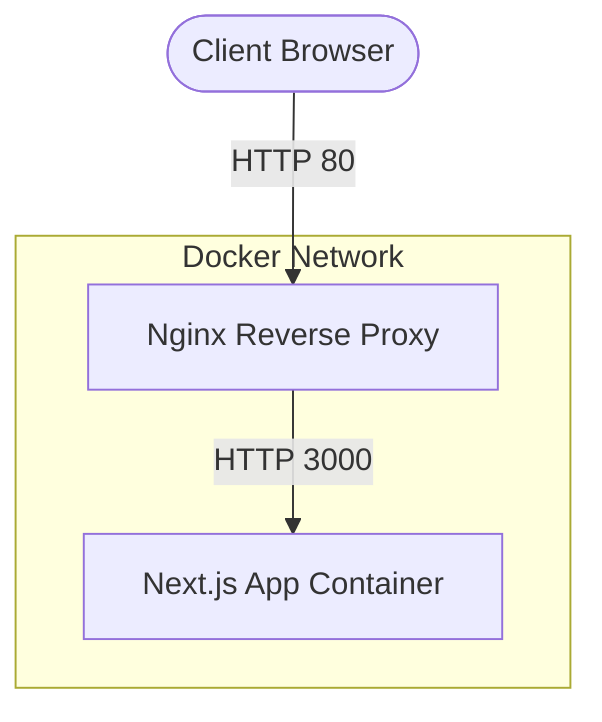

This is a [Next.js](https://nextjs.org) project bootstrapped with [`create-next-app`](https://nextjs.org/docs/app/api-reference/cli/create-next-app).

## Getting Started

First, run the development server:

```bash
npm run dev
# or
yarn dev
# or
pnpm dev
# or
bun dev
```

Open [http://localhost:3000](http://localhost:3000) with your browser to see the result.

You can start editing the page by modifying `app/page.tsx`. The page auto-updates as you edit the file.

This project uses [`next/font`](https://nextjs.org/docs/app/building-your-application/optimizing/fonts) to automatically optimize and load [Geist](https://vercel.com/font), a new font family for Vercel.

## Learn More

To learn more about Next.js, take a look at the following resources:

- [Next.js Documentation](https://nextjs.org/docs) - learn about Next.js features and API.
- [Learn Next.js](https://nextjs.org/learn) - an interactive Next.js tutorial.

You can check out [the Next.js GitHub repository](https://github.com/vercel/next.js) - your feedback and contributions are welcome!

## Deploy on Vercel

The easiest way to deploy your Next.js app is to use the [Vercel Platform](https://vercel.com/new?utm_medium=default-template&filter=next.js&utm_source=create-next-app&utm_campaign=create-next-app-readme) from the creators of Next.js.

Check out our [Next.js deployment documentation](https://nextjs.org/docs/app/building-your-application/deploying) for more details.

## Docker Architecture & Deployment

This project has been dockerized for easy deployment and scaling. The architecture consists of an Nginx reverse proxy routing traffic to a standalone Next.js container.



### How to Run with Docker

**1. Local Development / Testing**
To build and run the containers locally:
```bash
docker compose up -d --build
```
Access the application at `http://localhost` (Nginx automatically forwards to the Next.js app).

**2. Pushing to Docker Hub**
Use the provided PowerShell script to build and push the image to Docker Hub (`yslee4050/talkchamsae:latest`):
```bash
.\docker-push.ps1
```

**3. Deploying on Another Machine (Automated)**
For a seamless production deployment (e.g., on a fresh Rocky Linux VM), you can clone the repository and run the automated deployment script. The script will automatically install Docker and start the containers.

```bash
git clone https://github.com/hugingstar/EnglishYoutube.git
cd EnglishYoutube
./build.sh
```

During execution, select `1` to pull the image from Docker Hub (recommended) or `2` to build it locally.
