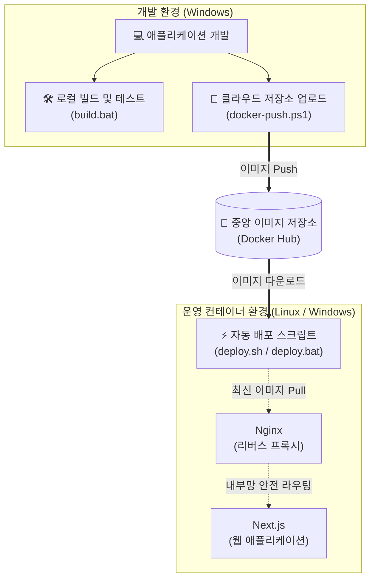
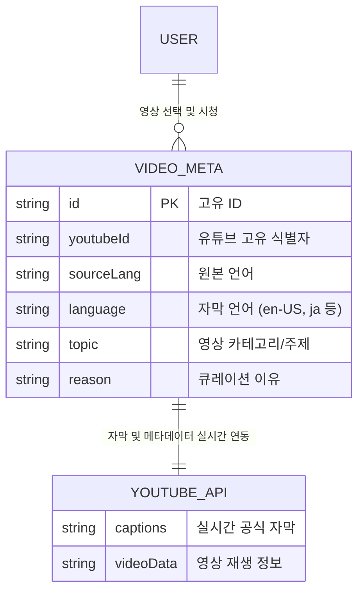

# 톡참새 (EnglishYoutube)

**톡참새(EnglishYoutube)**는 [Next.js](https://nextjs.org)를 기반으로 만들어진 원어민 일상 유튜브 영상 큐레이션 서비스입니다.
복잡한 환경 설정 없이, 스크립트 실행 한 번으로 로컬(내 PC) 테스트부터 실제 운영 서버 배포까지 완벽하게 자동화되어 초보자도 쉽게 다룰 수 있습니다.

---

## 🏗️ 시스템 아키텍처

서비스가 어떻게 동작하고 배포되는지 보여주는 전체 구조도입니다.

---

## 🗂️ 데이터 구조 (ER Diagram)

현재 서비스에서 관리하는 주요 정적 데이터(Curation)와 외부 유튜브 API와의 관계도입니다.

---

## 🚀 배포 가이드 (시작하기)

이 프로젝트는 도커(Docker) 기반으로 동작하므로, 아래 스크립트 중 본인의 상황에 맞는 **단 하나**만 실행하면 됩니다!

### 1. 내 컴퓨터에서 수정하고 테스트할 때 (개발용)
코드를 수정하고 내 PC에서 확인하고 싶을 때 사용합니다.
- **Windows:** `build.bat` (또는 `build.ps1`) 실행

### 2. 수정된 버전을 도커 허브(클라우드)에 올릴 때
내 PC에서 테스트가 완료된 완벽한 버전을 출시할 때 딱 1번 사용합니다.
- **Windows:** `docker-push.ps1` 실행

### 3. 실제 운영 서버에 최신 버전을 배포할 때 (실서버용)
도커 허브에 올라간 최신 버전을 다운로드 받아 서비스할 때 사용합니다. 빌드 과정이 생략되어 1초 만에 초고속 배포가 가능합니다.
- **Windows 환경:** `deploy.bat` 실행
- **Linux 환경:** `./deploy.sh` 실행

> **보안 안내:** Next.js 애플리케이션은 외부에 직접 포트를 열지 않고, 오직 Nginx를 통해서만 안전하게 접속되도록 내부망이 격리되어 있습니다. 포트 80을 통한 안전한 트래픽만 허용됩니다.
