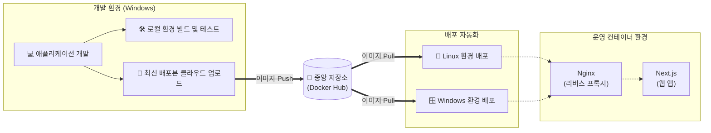

# 표준 기술 문서 (Standard Technical Document)
## 프로젝트명: 톡참새 (EnglishYoutube)

### 1. 개요 (Overview)
본 문서는 "톡참새 (EnglishYoutube)" 프로젝트의 아키텍처, 기술 스택 및 배포 워크플로우에 대한 공개용 기술 지침을 제공합니다. 본 프로젝트는 Next.js 프레임워크를 기반으로 구축된 웹 애플리케이션으로, 도커(Docker) 컨테이너 기반으로 완벽하게 가상화되어 로컬 개발 환경부터 운영 서버까지 일관된 실행 환경을 보장합니다.

### 2. 기술 스택 (Tech Stack)
- **Frontend/Backend:** Next.js
- **Containerization:** Docker, Docker Compose
- **Web Server / Reverse Proxy:** Nginx
- **OS (Target):** Linux (운영 환경), Windows (개발 환경)

### 3. 시스템 아키텍처 (System Architecture)

본 프로젝트는 서비스의 안정성과 보안을 극대화하기 위해 Nginx 리버스 프록시와 Docker 컨테이너 격리 기술을 활용한 아키텍처를 채택하고 있습니다.

#### 3.1 주요 구성 요소 설명
- **Nginx (리버스 프록시):** 외부에서 들어오는 모든 클라이언트 요청을 가장 먼저 맞이하는 관문입니다. Nginx는 비정상적인 요청을 1차적으로 필터링하고, 안전하게 내부망에 위치한 Next.js 컨테이너로 라우팅합니다. 이를 통해 직접적인 외부 공격으로부터 애플리케이션을 보호합니다.
- **Next.js (웹 애플리케이션):** 실제 서비스 비즈니스 로직과 프론트엔드 UI 렌더링을 담당하는 핵심 컨테이너입니다.
- **격리 및 보안 (내부망 통신):** Next.js 애플리케이션은 외부에 포트를 직접 노출하지 않습니다. 오직 Nginx를 거친 정상적인 트래픽만 내부 Docker 네트워크망을 통해 전달받아 응답합니다. 이러한 구조는 내부 서비스 포트 다이렉트 접속 시도를 원천 차단합니다.

#### 3.2 아키텍처 다이어그램 (Workflow)
로컬 개발부터 클라우드 운영 서버 배포까지의 전체적인 흐름도입니다.

### 4. 배포 워크플로우 (Deployment Workflow)
배포 프로세스는 스크립트를 통해 자동화되어 있으며, 역할에 따라 구분됩니다. 도커 허브에 이미지가 등록된 이후에는 배포용 스크립트 단 1회 실행으로 배포가 완료됩니다.

#### 4.1 배포 단계 (Deployment)
- `deploy.bat`: Windows 환경에서 최신 이미지를 다운로드(Pull)받아 무중단으로 컨테이너를 교체합니다.
- `deploy.sh`: Linux 환경에서 최신 이미지를 다운로드받아 즉시 서버를 교체합니다.

#### 4.2 개발 단계 (Development)
- `build.bat` / `build.ps1` / `build.sh`: 로컬(Windows/Linux)에서 코드를 직접 구워볼 때 사용하는 개발자용 스크립트입니다.
- `docker-push.ps1`: 개발 완료 후 새로운 릴리스 버전을 빌드하고, 클라우드 레지스트리에 업로드합니다.

### 5. 결론 (Conclusion)
본 프로젝트는 Docker를 활용하여 개발/운영 환경 간의 파편화를 제거하였으며, Nginx 리버스 프록시를 도입하여 보안성과 확장성을 동시에 확보했습니다. 자동화된 스크립트를 통해 신속하고 안정적인 CI/CD 및 인프라 관리를 지원합니다.
