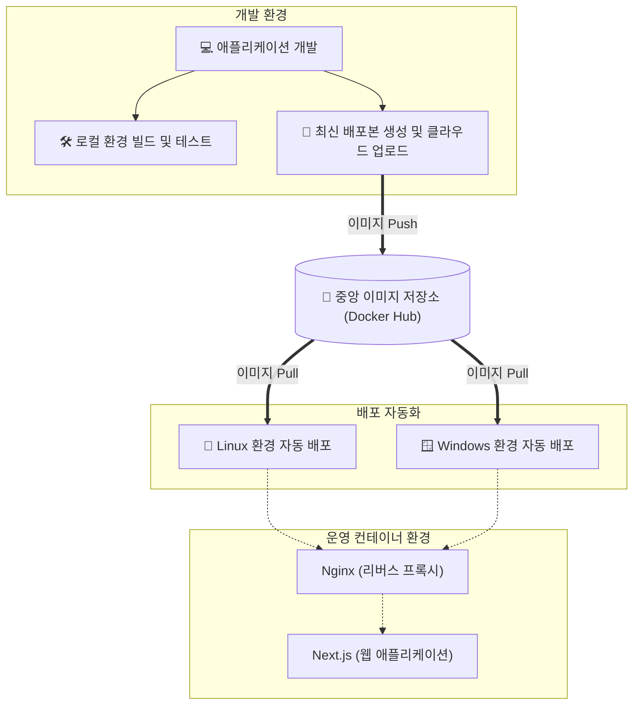

# 표준 기술 문서 (Standard Technical Document)
## 프로젝트명: 톡참새 (EnglishYoutube)

### 1. 개요 (Overview)
본 문서는 "톡참새 (EnglishYoutube)" 프로젝트의 아키텍처, 기술 스택 및 배포 워크플로우에 대한 공개용 기술 지침을 제공합니다. 본 프로젝트는 Next.js 프레임워크를 기반으로 구축된 웹 애플리케이션으로, 도커(Docker) 컨테이너 기반으로 완벽하게 가상화되어 로컬 개발 환경부터 운영 서버까지 일관된 실행 환경을 보장합니다.

### 2. 기술 스택 (Tech Stack)
- **Frontend/Backend:** Next.js
- **Containerization:** Docker, Docker Compose
- **Web Server / Reverse Proxy:** Nginx
- **OS (Target):** Linux (운영 환경), Windows (개발 환경)

### 3. 시스템 아키텍처 (System Architecture)
- **외부 요청 처리:** 클라이언트의 HTTP 요청은 운영 서버의 Nginx 리버스 프록시가 수신합니다.
- **내부 라우팅:** Nginx는 수신한 요청을 Docker 내부 네트워크를 통해 격리된 Next.js 앱 컨테이너로 전달합니다.
- **격리 및 보안:** Next.js 애플리케이션은 외부에 직접 노출되지 않으며, Nginx를 거쳐야만 접근 가능합니다. 외부망과 내부망을 철저히 분리하여 보안을 강화했습니다.

### 4. 배포 워크플로우 (Deployment Workflow)
배포 프로세스는 스크립트를 통해 자동화되어 있으며, 역할에 따라 구분됩니다. 도커 허브에 이미지가 등록된 이후에는 배포용 스크립트 단 1회 실행으로 배포가 완료됩니다.

#### 4.1 배포 단계 (Deployment)
- `deploy.bat`: Windows 환경에서 최신 이미지를 다운로드(Pull)받아 무중단으로 컨테이너를 교체합니다.
- `deploy.sh`: Linux 환경에서 최신 이미지를 다운로드받아 즉시 서버를 교체합니다.

#### 4.2 개발 단계 (Development)
- `build.bat` / `build.ps1` / `build.sh`: 로컬(Windows/Linux)에서 코드를 직접 구워볼 때 사용하는 개발자용 스크립트입니다.
- `docker-push.ps1`: 개발 완료 후 새로운 릴리스 버전을 빌드하고, 클라우드 레지스트리에 업로드합니다.

### 5. 결론 (Conclusion)
본 프로젝트는 Docker를 활용하여 개발/운영 환경 간의 파편화를 제거하였으며, Nginx 리버스 프록시를 도입하여 보안성과 확장성을 동시에 확보했습니다. 자동화된 스크립트를 통해 신속하고 안정적인 CI/CD 및 인프라 관리를 지원합니다.
